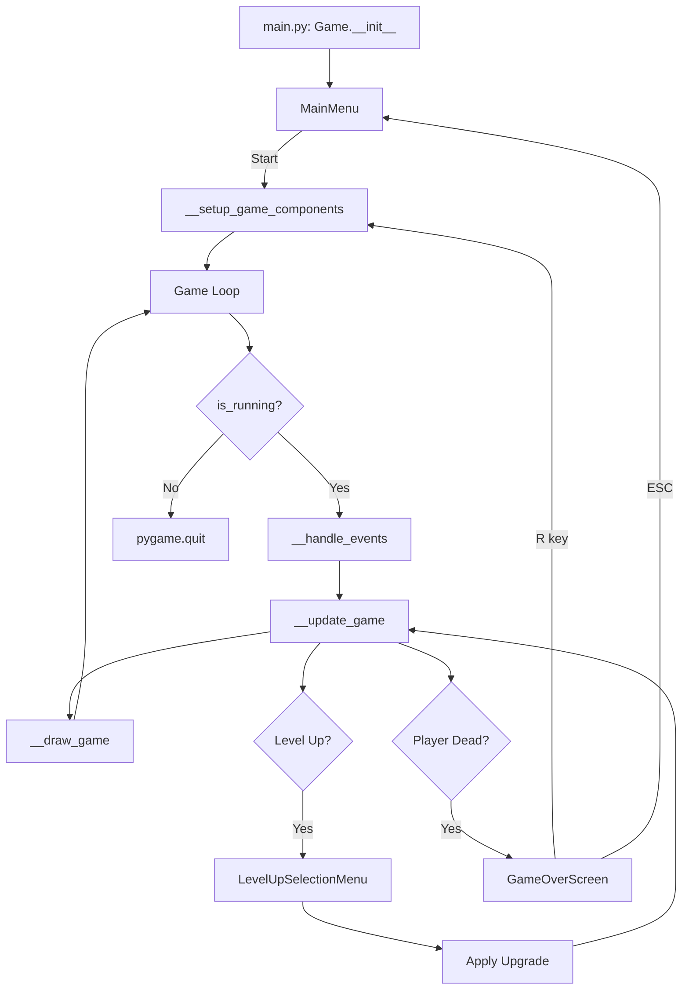

# 📁 InForHell - Struktur Kode Python

> Game bertema **Vampire Survivor** dengan arsitektur OOP yang kuat.  
> Dibuat menggunakan **Pygame** dengan pola desain berbasis *encapsulation* dan *composition*.

---

## 📋 Daftar File Python

| No | File | Ukuran | Deskripsi Singkat |
|----|------|--------|-------------------|
| 1 | `main.py` | 15.3 KB | Entry point game dan game loop utama |
| 2 | `settings.py` | 1.1 KB | Konstanta dan konfigurasi global |
| 3 | `entities.py` | 7.0 KB | Base classes abstrak untuk semua entitas |
| 4 | `player.py` | 10.0 KB | Implementasi Player dan PlayerStats |
| 5 | `enemies.py` | 11.3 KB | Sistem musuh dengan berbagai tipe |
| 6 | `weapons.py` | 4.4 KB | Implementasi proyektil (Bullet, KeyboardProjectile) |
| 7 | `sprites.py` | 1.0 KB | Sprite dasar untuk objek statis |
| 8 | `groups.py` | 0.9 KB | Custom sprite group dengan camera offset |
| 9 | `inventory.py` | 3.6 KB | Sistem inventory untuk skills dan passives |
| 10 | `pathfinding.py` | 4.8 KB | Algoritma BFS untuk navigasi AI |
| 11 | `game_managers.py` | 10.9 KB | GameState, SpawnManager, CollisionManager |
| 12 | `combat_system.py` | 13.6 KB | Upgrade, Weapon, Skill, dan PassiveItem |
| 13 | `upgrade_system.py` | 10.9 KB | Database upgrade dan kartu level up |
| 14 | `ui.py` | 47.1 KB | Sistem UI lengkap (menu, HUD, overlay) |

---

## 📖 Detail Setiap File

---

### 1. `main.py` - Entry Point Game

**Deskripsi:**  
File utama yang mengontrol keseluruhan game. Berisi class `Game` yang mengatur inisialisasi, game loop, dan manajemen state.

**Komponen Utama:**

| Class/Function | Deskripsi |
|----------------|-----------|
| `Game` | Class utama game yang mengelola semua komponen |
| `__init__()` | Inisialisasi pygame, display, menu, dan komponen game |
| `__setup_game_components()` | Setup/reset semua komponen saat Start/Restart |
| `__load_images()` | Memuat gambar bullet dan enemy frames |
| `__setup()` | Setup dunia game dari TMX map (tiles, objects, entities) |
| `__handle_events()` | Handle input untuk berbagai state (Menu, Gameplay, Pause, Level Up) |
| `__restart_game()` | Reset total game |
| `__update_game(dt)` | Update logika game (shooting, collision, spawn, UI) |
| `__gun_timer()` | Mengatur cooldown senjata |
| `__auto_shoot()` | Auto-shoot ke arah mouse (mendukung multi-shot) |
| `__bullet_collision()` | Deteksi tabrakan peluru dengan musuh |
| `__trigger_level_up()` | Memunculkan menu level up selection |
| `__player_collision()` | Deteksi tabrakan player dengan musuh |
| `__draw_game()` | Render semua elemen (menu/gameplay/pause/game over) |
| `run()` | Main game loop |

**Dependencies:**
- `settings`, `player`, `sprites`, `weapons`, `enemies`, `groups`, `ui`, `game_managers`, `combat_system`, `pathfinding`, `upgrade_system`

---

### 2. `settings.py` - Konfigurasi Global

**Deskripsi:**  
Menyimpan semua konstanta dan konfigurasi yang digunakan di seluruh game.

**Konstanta yang Didefinisikan:**

| Kategori | Konstanta | Nilai | Deskripsi |
|----------|-----------|-------|-----------|
| **Window** | `WINDOW_WIDTH` | 1280 | Lebar layar |
| | `WINDOW_HEIGHT` | 720 | Tinggi layar |
| | `TILE_SIZE` | 64 | Ukuran tile map |
| **Game** | `FPS` | 60 | Frame per second |
| **Player** | `PLAYER_SPEED` | 300 | Kecepatan player |
| | `PLAYER_MAX_HEALTH` | 100 | HP maksimum player |
| | `PLAYER_BASE_DAMAGE` | 10 | Damage dasar player |
| **Weapon** | `GUN_COOLDOWN` | 200 | Cooldown tembakan (ms) |
| | `BULLET_SPEED` | 1200 | Kecepatan peluru |
| | `BULLET_LIFETIME` | 1000 | Durasi hidup peluru (ms) |
| **Enemy** | `ENEMY_SPAWN_INTERVAL` | 2000 | Interval spawn musuh (ms) |
| | `ENEMY_BASE_SPEED` | 100 | Kecepatan dasar musuh |
| | `ENEMY_SPAWN_DISTANCE` | 600 | Jarak spawn dari player |
| **Progression** | `EXP_BASE` | 100 | EXP dasar untuk level up |
| | `EXP_MULTIPLIER` | 1.5 | Multiplier EXP per level |
| | `HEALTH_PER_LEVEL` | 20 | HP tambahan per level |
| **UI Colors** | `WHITE`, `BLACK`, `RED`, `GREEN`, `BLUE`, `YELLOW`, `GRAY`, `DARK_GRAY` | RGB tuples | Warna UI |

---

### 3. `entities.py` - Base Classes (Layer 1)

**Deskripsi:**  
Mendefinisikan abstract base classes untuk semua entitas game dengan encapsulation penuh.

**Hierarki Class:**

```
pygame.sprite.Sprite
    │
    ├── GameEntity (ABC) ─────────────────────────────────
    │       ├── Actor (ABC) → Player, Enemy
    │       ├── Projectile (ABC) → Bullet, KeyboardProjectile
    │       └── ItemDrop (ABC) → ExpOrb, HealthOrb
```

**Detail Class:**

| Class | Parent | Deskripsi |
|-------|--------|-----------|
| `GameEntity` | `Sprite`, `ABC` | Base class untuk semua objek game. Properties: `__position`, `__is_active` |
| `Actor` | `GameEntity`, `ABC` | Base class untuk entitas hidup. Properties: `__hp_max`, `__hp_current`, `__speed` |
| `Projectile` | `GameEntity`, `ABC` | Base class untuk proyektil. Properties: `__damage`, `__direction`, `__pierce`, `__max_range` |
| `ItemDrop` | `GameEntity`, `ABC` | Base class untuk item drop. Properties: `__value`, `__attraction_radius` |

**Method Penting:**

| Class | Method | Return | Deskripsi |
|-------|--------|--------|-----------|
| `Actor` | `take_damage(amount)` | `bool` | Mengurangi HP, return True jika mati |
| `Actor` | `heal(amount)` | `None` | Menambah HP (max = hp_max) |
| `Actor` | `is_alive()` | `bool` | Cek apakah masih hidup |
| `Projectile` | `hit_enemy()` | `bool` | Cek pierce, return True jika masih bisa hit |
| `ItemDrop` | `move_towards_player(pos, dt)` | `None` | Bergerak ke player jika tertarik |

---

### 4. `player.py` - Sistem Player

**Deskripsi:**  
Implementasi Player character dengan sistem statistik terenkapsulasi.

**Class yang Didefinisikan:**

#### `PlayerStats`
Mengelola semua statistik player dengan private attributes.

| Property | Tipe | Deskripsi |
|----------|------|-----------|
| `max_health` | `int` | HP maksimum |
| `current_health` | `int` | HP saat ini |
| `base_damage` | `int` | Damage dasar |
| `base_speed` | `int` | Kecepatan dasar |
| `level` | `int` | Level saat ini |
| `current_exp` | `int` | EXP saat ini |
| `exp_to_next_level` | `int` | EXP yang dibutuhkan |
| `kills` | `int` | Jumlah kill |
| `is_alive` | `bool` | Status hidup |
| `health_percentage` | `float` | Persentase HP |
| `exp_percentage` | `float` | Persentase EXP |

**Methods:**
- `take_damage(damage)` - Mengurangi HP
- `heal(amount)` - Menambah HP
- `add_exp(amount)` - Tambah EXP, return True jika level up
- `add_kill()` - Increment kill count
- `increase_max_health/damage/speed(amount)` - Boost stats
- `decrease_max_health(amount)` - Untuk risk/reward upgrades

#### `Player`
Class utama player dengan sprite dan movement.

| Attribute | Tipe | Deskripsi |
|-----------|------|-----------|
| `weapon` | `WeaponDefault` | Senjata auto-shoot |
| `active_skill` | `Skill` | Skill aktif (Space/Q) |
| `stat_modifiers` | `dict` | Modifier: speed, damage, cooldown, max_health |
| `multi_shot_count` | `int` | Jumlah peluru per tembakan |
| `lifesteal_chance` | `float` | Chance lifesteal (0.0 - 1.0) |

**Methods:**
- `input()` - Handle WASD/Arrow + Skill activation
- `take_damage(damage)` - Terima damage dengan invulnerability
- `gain_exp(amount)` - Dapat EXP
- `apply_dash(speed, duration)` - Efek dash
- `move(dt)` - Pergerakan dengan collision
- `animate(dt)` - Animasi sprite

---

### 5. `enemies.py` - Sistem Musuh

**Deskripsi:**  
Implementasi berbagai tipe musuh dengan AI dan separation logic (Swarm AI).

**Hierarki Class:**

```
Enemy (ABC)
    ├── BasicEnemy     (HP: 50, Speed: 150, Damage: 10, EXP: 10)
    ├── FastEnemy      (HP: 30, Speed: 250, Damage: 15, EXP: 15)
    ├── TankEnemy      (HP: 150, Speed: 80, Damage: 25, EXP: 25)
    ├── ZigzagEnemy    (HP: 40, Speed: 180, Damage: 12, EXP: 20)
    └── CirclingEnemy  (HP: 60, Speed: 200, Damage: 18, EXP: 30)
```

**Class `Enemy` (Base):**

| Property | Deskripsi |
|----------|-----------|
| `damage` | Damage ke player |
| `exp_value` | EXP reward saat mati |
| `is_dead` | Status mati |
| `exp_given` | Apakah EXP sudah diberikan |
| `health_percentage` | Persentase HP |

**Methods Penting:**
- `take_damage(damage)` - Menerima damage, return True jika mati
- `_calculate_direction()` - Abstract, AI movement direction
- `_get_separation_vector()` - Menghindari tumpukan dengan musuh lain
- `move(dt)` - Pergerakan dengan separation (80% kejar, 20% hindari)
- `destroy()` - Animasi mati
- `give_exp_reward()` - Memberikan EXP ke player

**`EnemyFactory`:**
Factory pattern untuk spawn musuh.

| Enemy Type | Class Mapping |
|------------|---------------|
| slime, redblob, ghost | `BasicEnemy` |
| toast, paper | `TankEnemy` |
| books | `FastEnemy` |
| spider | `ZigzagEnemy` |

---

### 6. `weapons.py` - Sistem Proyektil

**Deskripsi:**  
Implementasi visualisasi proyektil untuk senjata dan skill.

**Class yang Didefinisikan:**

#### `Bullet`
Proyektil peluru standar.

| Attribute | Deskripsi |
|-----------|-----------|
| `__spawn_time` | Waktu spawn |
| `__lifetime` | Durasi hidup (BULLET_LIFETIME) |
| `__direction` | Arah terbang |
| `__speed` | Kecepatan (BULLET_SPEED) |
| `__damage` | Damage peluru |

#### `ProjectileShadow`
Bayangan untuk proyektil jatuh (elips hitam transparan).

#### `KeyboardProjectile`
Proyektil untuk skill Keyboard Rain.

| Attribute | Deskripsi |
|-----------|-----------|
| `__target_pos` | Posisi target di tanah |
| `__height` | Ketinggian saat ini (mulai 1000) |
| `__fall_speed` | Kecepatan jatuh (1000 px/s) |
| `__has_landed` | Status sudah mendarat |
| `__shadow` | Referensi ke bayangan |
| `__linger_duration` | Durasi sebelum hilang (200ms) |

**Mekanisme:**
- Proyektil jatuh dari ketinggian 1000 pixel
- Visual dengan ukuran 120x60 (abu-abu dengan border)
- Bayangan muncul di posisi target
- Damage diberikan saat jatuh dan mendarat

---

### 7. `sprites.py` - Sprite Dasar

**Deskripsi:**  
Implementasi sprite dasar untuk objek game statis.

| Class | Deskripsi |
|-------|-----------|
| `Sprite` | Sprite untuk objek visual (tanah, dekorasi). Memiliki flag `ground = True` |
| `CollisionSprite` | Sprite dengan collision (tembok, obstacle) |

Kedua class sangat sederhana, hanya menyimpan `image` dan `rect`.

---

### 8. `groups.py` - Sprite Groups

**Deskripsi:**  
Custom sprite group untuk rendering dengan camera offset.

**Class `AllSprites`:**

Extends `pygame.sprite.Group` dengan fitur:
- `offset` - Vektor offset kamera
- `draw(target_pos)` - Render sprite dengan offset berdasarkan posisi target

**Rendering Order:**
1. Ground sprites (memiliki `ground` attribute)
2. Object sprites (tidak memiliki `ground` attribute)
3. Diurutkan berdasarkan `rect.centery` (Y-sorting untuk depth)

---

### 9. `inventory.py` - Sistem Inventory

**Deskripsi:**  
Sistem inventory untuk mengelola skills dan passive items player.

**Class `Inventory`:**

| Property | Tipe | Deskripsi |
|----------|------|-----------|
| `skills` | `list` (copy) | List skill yang dimiliki |
| `passives` | `list` (copy) | List passive item yang dimiliki |
| `__max_skills` | 6 | Maksimum skill |
| `__max_passives` | 6 | Maksimum passive |

**Methods:**
- `update(dt)` - Update semua skill
- `add_upgrade(upgrade)` - Tambah upgrade baru atau level up yang sudah ada
- `apply_all_passives()` - Apply semua stat passive ke owner
- `get_upgrade_count()` - Total jumlah upgrade
- `is_skill_full()` / `is_passive_full()` - Cek kapasitas

---

### 10. `pathfinding.py` - Navigasi AI

**Deskripsi:**  
Implementasi algoritma BFS (Breadth-First Search) untuk navigasi musuh.

**Class `Pathfinder`:**

| Attribute | Deskripsi |
|-----------|-----------|
| `matrix` | Grid 2D (0 = jalan, 1 = tembok) |
| `width`, `height` | Dimensi grid |

**Methods:**

| Method | Deskripsi |
|--------|-----------|
| `__create_grid(tmx_map)` | Konversi TMX map ke matrix collision |
| `get_path(start_pos, target_pos)` | Return vektor arah ke target |

**Algoritma:**
1. Konversi posisi pixel ke grid index
2. BFS dari start ke end
3. Rekonstruksi jalur (backtrack dari end)
4. Return vektor arah ke langkah pertama

**Layer yang Diproses:**
- "Collisions" - Area collision
- "Objects" - Objek dengan collision

---

### 11. `game_managers.py` - Sistem Manajemen (Layer 5)

**Deskripsi:**  
Mengelola state game, spawn musuh, dan deteksi collision.

**Classes:**

#### `GameState`
Mengelola state permainan.

| Property | Tipe | Deskripsi |
|----------|------|-----------|
| `is_running` | `bool` | Game loop berjalan |
| `is_paused` | `bool` | Game di-pause |
| `is_game_over` | `bool` | Game over |
| `elapsed_time` | `float` | Waktu berlalu (detik) |
| `score` | `int` | Skor akhir |

**Skor Formula:** `(kills × 100) + (level × 500) + (time × 10)`

#### `SpawnManager`
Mengelola kemunculan musuh.

| Property | Deskripsi |
|----------|-----------|
| `difficulty_multiplier` | Multiplier kesulitan |
| `enemies_spawned` | Total musuh yang di-spawn |

**Difficulty Scaling:**
- Setiap 30 detik: +20% kesulitan
- Interval spawn berkurang seiring waktu (min 500ms)

#### `CollisionManager`
Mengelola semua deteksi collision.

| Method | Return | Deskripsi |
|--------|--------|-----------|
| `check_bullet_enemy(...)` | `dict` | Cek peluru vs musuh, return kills/exp/level_up |
| `check_player_enemy(...)` | `bool` | Cek player vs musuh, return True jika kena damage |
| `check_player_item(...)` | `list` | Cek player vs item, return list item yang diambil |

**Fitur Lifesteal:**
- Cek `player.lifesteal_chance` saat bullet hit enemy
- Random chance untuk heal 1 HP

---

### 12. `combat_system.py` - Sistem Combat (Layer 3)

**Deskripsi:**  
Implementasi sistem upgrade, weapon, skill, dan passive item.

**Hierarki Class:**

```
Upgrade (ABC)
    ├── AttackMechanism (ABC)
    │       ├── WeaponDefault
    │       └── Skill
    │               └── KeyboardRain
    └── PassiveItem
            ├── VitalityPassive
            ├── SpeedBoostPassive
            ├── DamageBoostPassive
            └── HealthRegenPassive
```

#### `Upgrade` (ABC)
Base class untuk semua upgrade.

| Property | Deskripsi |
|----------|-----------|
| `name` | Nama upgrade |
| `description` | Deskripsi |
| `level` | Level saat ini |
| `max_level` | Level maksimum |

#### `AttackMechanism` (ABC)
Base class untuk weapon dan skill.

| Property | Deskripsi |
|----------|-----------|
| `cooldown` | Cooldown dengan modifier |
| `damage` | Damage value |
| `cooldown_progress` | Progress 0.0 - 1.0 |

#### `WeaponDefault`
Senjata default (pistol) dengan auto-shoot.

**Fitur Multi-shot:**
- Mendukung 1-6+ peluru per tembakan
- Spread angle 30 derajat
- Controlled via `player.multi_shot_count`

#### `KeyboardRain` (Skill)
Skill aktif: Hujan keyboard.

| Parameter | Nilai |
|-----------|-------|
| Cooldown | 10 detik |
| Damage | 100 |
| Spawn Interval | 100ms saat aktif |
| Duration | 3 detik |
| Coverage | Full screen (camera view) |

#### Passive Items

| Class | Stat | Nilai per Level |
|-------|------|-----------------|
| `VitalityPassive` | Max HP | +20 |
| `SpeedBoostPassive` | Speed | +10% |
| `DamageBoostPassive` | Damage | +15% |
| `HealthRegenPassive` | Regen | +1 HP/sec |

---

### 13. `upgrade_system.py` - Database Upgrade

**Deskripsi:**  
Sistem database untuk upgrade cards dan level up selection.

**Classes:**

#### `UpgradeCard`
Representasi kartu upgrade individual.

| Property | Deskripsi |
|----------|-----------|
| `id` | ID unik |
| `name` | Nama upgrade |
| `description` | Deskripsi |
| `type` | 'stat', 'weapon', 'passive' |
| `rarity` | 'common', 'rare', 'epic', 'legendary' |
| `current_level` | Level saat ini |
| `max_level` | Level maksimum |
| `icon_color` | Warna icon |
| `is_new` | Apakah upgrade baru |

#### `UpgradeDatabase`
Database untuk semua upgrade.

**Methods:**
- `register_upgrade(data)` - Daftarkan upgrade baru
- `get_available_upgrades(count=3)` - Ambil random upgrade untuk selection
- `apply_upgrade(id, player)` - Apply upgrade ke player

**Selection Strategy:**
- 60% chance untuk upgrade baru
- 40% chance untuk level up existing

**Upgrade Tema "Neraka Informatika":**

| ID | Nama | Efek |
|----|------|------|
| `bocoran_soal` | Bocoran Soal Kating | +25% EXP Gain per level |
| `sks` | SKS (Sistem Kebut Semalam) | +15% Damage, -10 Max HP per level |
| `broadcasting_protocol` | Broadcasting Protocol | +1 peluru per level (multi-shot) |
| `kopi_sachet` | Kopi Sachet | +15% Movement Speed per level |
| `plagiat_tugas` | Plagiat Tugas | 5-15% chance lifesteal |
| `gpthelper` | GPTHelper | -10% Skill Cooldown per level |
| `health_boost` | Vitality Boost | +20 Max Health per level |

---

### 14. `ui.py` - Sistem User Interface

**Deskripsi:**  
Modul UI lengkap dengan berbagai komponen untuk menu, HUD, dan overlay.

**File terbesar (47 KB)** dengan banyak class:

#### Base Classes

| Class | Deskripsi |
|-------|-----------|
| `UIElement` | Base class dengan encapsulation (pos, size, visible) |
| `HealthBar` | Health bar dengan gradasi warna (green/yellow/red) |
| `ExperienceBar` | EXP bar dengan warna biru |
| `TextLabel` | Label teks dengan font dan warna customizable |
| `Button` | Tombol dengan tema "Molten Rock & Lava" |

#### Menu Systems

| Class | Deskripsi |
|-------|-----------|
| `MainMenu` | Menu utama dengan logo dan tombol Start/Leaderboard/Exit |
| `PauseMenu` | Menu pause dengan opsi Continue/Main Menu |
| `GameOverScreen` | Layar game over dengan statistik akhir |
| `LevelUpNotification` | Notifikasi popup saat level up |
| `LevelUpSelectionMenu` | Menu pilih 3 kartu upgrade |

#### HUD Components

| Class | Deskripsi |
|-------|-----------|
| `GameUI` | Manager UI utama yang mengkoordinasi semua elemen |
| `UpgradeCardUI` | Kartu upgrade dengan tema "Cursed Technology" |
| `FireParticle` | Partikel efek api untuk background |

**Tema Visual:**

1. **Molten Rock & Lava (Button)**
   - Stone surface dark: `#3E2828`
   - Lava glow: `#FF8C00`
   - Magma outline: `#1A0F0F`
   - Hot text: `#FFE5B4`

2. **Cursed Technology (Cards)**
   - Blood red: `#C81414`
   - Hell black: `#140505`
   - Fire orange: `#FF6414`
   - Glitch white: `#FFF0DC`

---

## 🏗️ Arsitektur Layer

```
LAYER 5: Management Systems
    └── game_managers.py (GameState, SpawnManager, CollisionManager)

LAYER 4: Support Systems
    └── inventory.py, pathfinding.py, upgrade_system.py

LAYER 3: Combat System
    └── combat_system.py (Upgrade, AttackMechanism, Skill, PassiveItem)

LAYER 2: Game Entities
    ├── player.py (Player, PlayerStats)
    ├── enemies.py (Enemy hierarchy, EnemyFactory)
    └── weapons.py (Bullet, KeyboardProjectile)

LAYER 1: Base Classes
    ├── entities.py (GameEntity, Actor, Projectile, ItemDrop)
    └── sprites.py (Sprite, CollisionSprite)

LAYER 0: Foundation
    ├── settings.py (Constants & Configuration)
    ├── groups.py (AllSprites with camera)
    └── ui.py (Complete UI system)

ENTRY POINT:
    └── main.py (Game class & main loop)
```

---

## 🎮 Alur Game



---

## 📝 Prinsip OOP yang Digunakan

1. **Encapsulation** - Private attributes dengan `__` prefix dan getter/setter
2. **Inheritance** - Hierarki class (GameEntity → Actor → Player)
3. **Polymorphism** - Abstract methods (`_calculate_direction()` di Enemy subclasses)
4. **Composition** - Player memiliki PlayerStats, Weapon, Skill
5. **Factory Pattern** - EnemyFactory untuk spawn musuh
6. **Observer Pattern** - UI mengobservasi PlayerStats

---

*Dokumentasi ini dibuat otomatis berdasarkan analisis kode sumber.*
